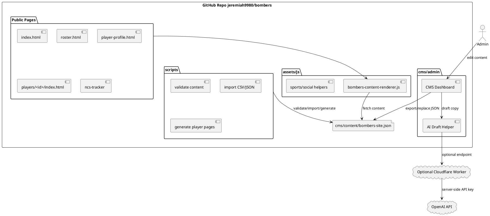

# SPEC-2-Bombers-CMS-Repo-Integration

## Background

The `jeremiah9980/bombers` GitHub Pages site already contains static pages and sports/team modules, including `index.html`, `roster.html`, `player-profile.html`, `players/`, `roster/`, `ncs-monitor/`, `ncs-tracker/`, `scripts/`, and `cms/`.

This design attaches the CMS directly to the repository structure by making `cms/content/bombers-site.json` the single source of truth for public page content and by adding a reusable renderer for public pages.

## Requirements

### Must Have

- Manage Home page content.
- Manage social media embedded sections.
- Manage Bombers team information.
- Store GameChanger team ID, URLs, schedule references, and stat tables.
- Store NCS team ID and tournament dashboard tracking data.
- Manage roster.
- Manage player profile pages.
- Include AI-assisted drafting for safe youth-sports content.
- Work with GitHub Pages static hosting.

### Should Have

- Validate content before publishing.
- Prevent accidental public player profiles unless guardian media release is marked true.
- Generate static player pages for GitHub Pages.
- Support manual imports from approved GameChanger/NCS exports.
- Keep API keys out of public frontend files.

### Could Have

- Cloudflare Worker or other backend endpoint for real OpenAI-powered draft generation.
- GitHub OAuth or Decap CMS later for browser-based commits.
- Scheduled sports data refresh from authorized/public feeds.

### Won't Have in MVP

- Bypassing GameChanger/NCS login.
- Scraping private, protected, or paywalled data.
- Public exposure of OpenAI API keys.
- Full database backend.

## Method

## Implementation

1. Copy the package files into the root of the `jeremiah9980/bombers` repo.
2. Commit `cms/content/bombers-site.json`.
3. Add `assets/css/bombers-cms-managed.css` to public pages.
4. Add `assets/js/bombers-content-renderer.js` to public pages.
5. Add page mount elements:
   - `

`
   - `<section data-bombers-team-info></section>`
   - `<section data-bombers-social></section>`
   - `<section data-bombers-schedule></section>`
   - `<section data-bombers-stats></section>`
   - `<section data-bombers-ncs></section>`
   - `<section data-bombers-roster></section>`
   - `<main data-bombers-player-profile></main>`
6. Use `cms/admin/index.html` locally or protect it before making it public.
7. Run validation before publishing:
   - `node scripts/validate-bombers-content.mjs`
8. Generate static player pages:
   - `node scripts/generate-player-pages.mjs`

## Milestones

1. Commit CMS data model and admin dashboard.
2. Wire homepage sections to CMS renderer.
3. Wire roster and player-profile pages.
4. Add GameChanger and NCS IDs.
5. Add manual import scripts.
6. Add optional AI Worker.
7. Enable validation workflow.

## Gathering Results

- Public pages render from `cms/content/bombers-site.json`.
- CMS can export valid content JSON.
- Roster cards appear correctly.
- Player profiles only publish when profile is enabled and guardian release is true.
- GameChanger and NCS tracker sections display configured IDs, links, and manually imported/approved data.
- AI drafting improves content speed without exposing private information or API keys.

## Need Professional Help in Developing Your Architecture?

Please contact me at [sammuti.com](https://sammuti.com) :)
