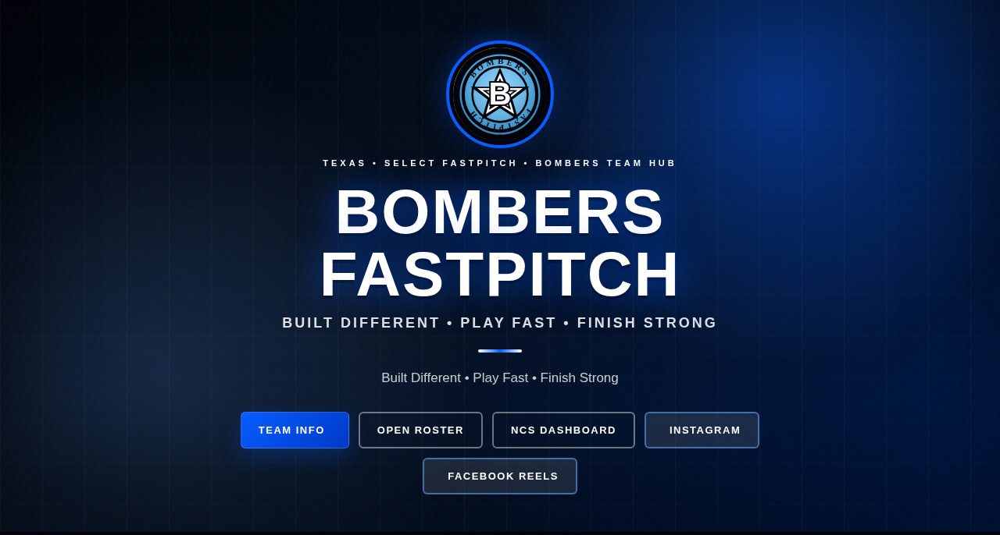

# Hero CTA Button Polish — UI Suggestion (awaiting approval)

A focused, low-risk improvement to the homepage hero call-to-action buttons in
`index.html`. It is scoped to the hero only — social, schedule, stats, NCS, and
fundraising sections are untouched.

## Before

## After

## What changed

- **Removed the heavy inline styles** from the five hero CTA buttons and replaced
  them with a reusable class system: a `.hero-actions` flex container plus
  `.hero-btn` with `--primary`, `--outline`, `--instagram`, and `--facebook`
  variants (added to `assets/css/team-primetime.css` under a commented
  `Hero CTA polish` block).
- **Consistent sizing and shape** across all buttons: shared padding, an 8px
  radius, and aligned icon + label.
- **Accessibility:** buttons now have a visible `:focus-visible` outline
  (electric-blue, offset) for keyboard navigation.
- **Mobile tap targets:** every button has `min-height: 44px`, and on narrow
  screens (<=520px) buttons expand to full width so they are easy to tap and
  wrap cleanly.
- **Subtle interaction polish:** a gentle hover lift + glow, brand-tinted hover
  states for Instagram/Facebook, and a `prefers-reduced-motion` fallback.
- **Typography rhythm:** slightly refined hero tagline weight/tracking and CTA
  spacing. No wording, links, icons, or color identity were changed — the dark
  electric-blue Bombers look is preserved.

## Why it improves UX

- **Consistency** — one source of truth for hero button styling instead of
  duplicated inline CSS.
- **Maintainability** — future button tweaks happen in one CSS block.
- **Accessibility** — keyboard focus is now clearly visible.
- **Mobile usability** — comfortable, thumb-friendly 44px targets that wrap
  gracefully.

## Status

Proposal only — awaiting human approval before adopting.
